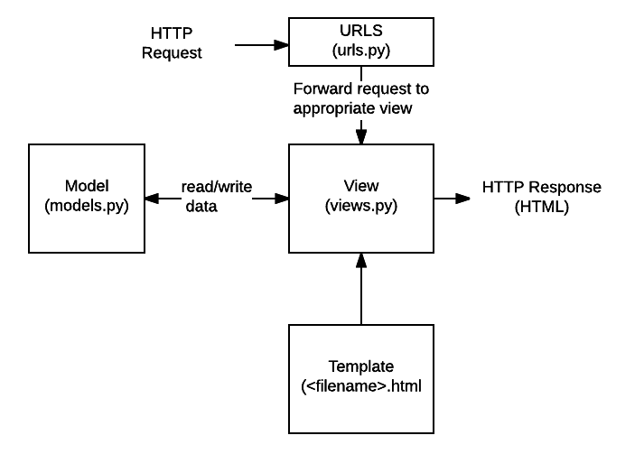

# Learning Django #

#### Working of Django ####



1. **URL Mapper**: It redirects the HTTP requests to appropriate view based on request received from the user. 
2. **View**: A view is a request handler function, which receives HTTP requests and returns HTTP responses.
3. **Models**: define the structure of the application data and how to add, update and delete and query records
4. **Templates**: holds the structure of a file with placeholders for data to be put in later when application runs


- **urls.py** --> here we define the mapping between routes and their view functions. it is a list of path() or re_path()

    ```
    import . from views

    urlpatterns = [
        # path('name_of_route', views.function_name, name='route_name')
        path('about', views.about, name='about')
    ]
    ```

- **views.py** --> here we set functions which define the response for HTTP requests

    ```
    from django.http import HTTPResponse

    def about(request):
        return HTTPResponse('''
            <!- html code goes here -->
        ''')
    ```


### Running the django administration page ###
- goto `localhost:8080/admin`
- if login does not work, run `python3 manage.py migrate`
- then run `python3 manage.py createsuperuser`

### Creating models ### 
- Inside the models.py file, import models from django
- `def func_name(models.Model): ` is used to create a new table with the values listed under it. 
- in order to create the table in the database, you have to make migrations using `python manage.py makemigrations <appname>`
- to apply these migrations, run `python manage.py migrate <appname>`
- the template for these model must be in a directory called `templates` and the path to this directory must be mentioned inside the settings.py file as `os.join.path(BASE_DIR, 'relative dir')`
- an `app_label` is also necessary to for the model to run and must be specified inside the settings.py file
 - [link for reference]('https://learnbatta.com/blog/django-create-table-from-model-104/)

 #### What are migrations? ####
 - migrations are essentially used to propogate changes made in models to the actual database being used. 
 - `makemigrations` is analogous to committing changes in git
 - `migrate` is used apply those changes to the database

 